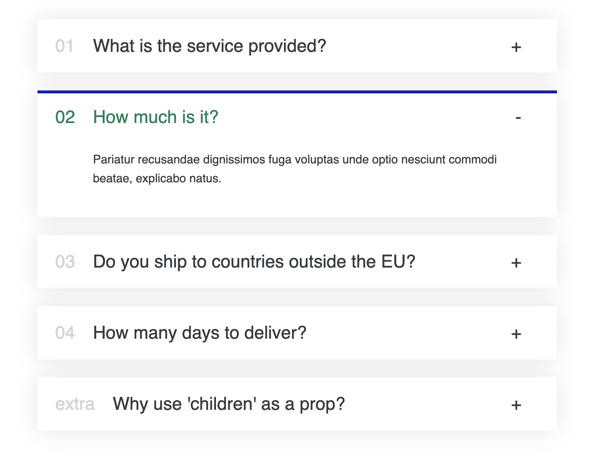
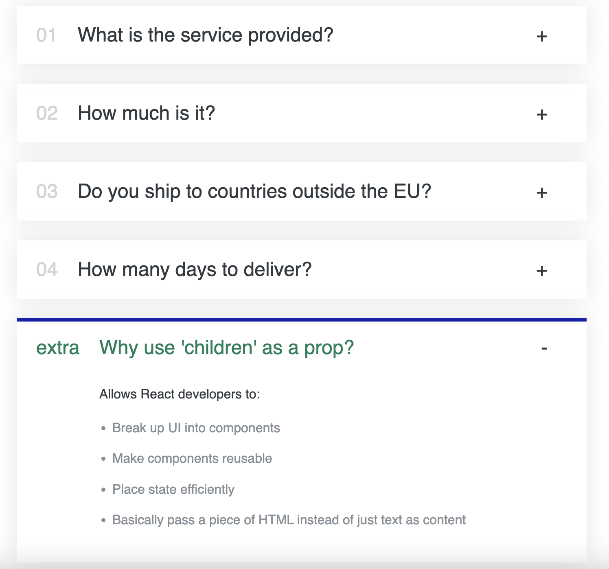

# 🌍 Accordion component for React

 The component is designed to display frequently asked questions (FAQs) and their answers in an interactive manner. Users can click on any FAQ to expand or collapse its content.

## 📝 Features:
-**Interactive**: Easily expand or collapse content.
-**Customizable**: Feed in any array of data to display.
-**Styled**: Simple and clean design with clear UX indications.

## 📘 React Concepts Learnt:

-**Props**: Efficient data transfer between components.
-**State & useState**: Dynamically managing data within a component.
-**Functional Updates**: Safely updating state based on the previous state.
-**Event Handlers**: Enhancing component interactivity.
-**Children Props**: Flexibly passing JSX elements as content to components.
